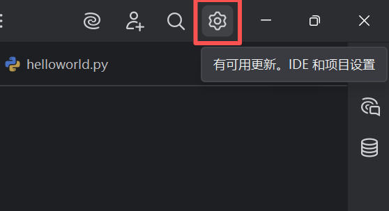
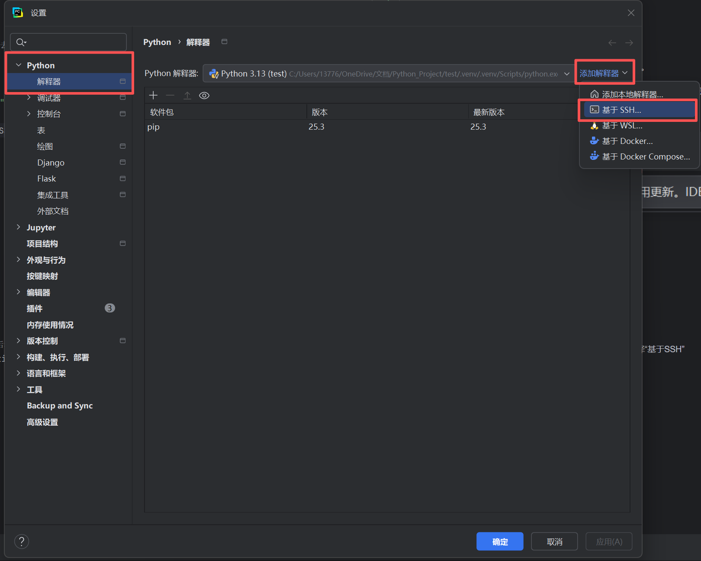
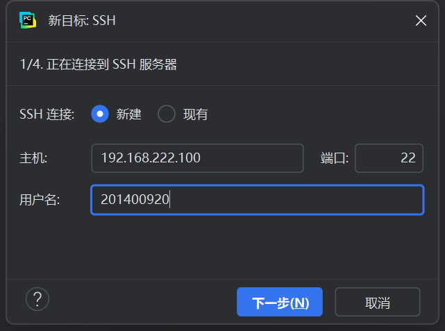

# 高算平台使用教程

## 一、远程连接高算平台

### 1、PyCharm远程连接

首先必须要有pycharm pro订阅，否则无法使用远程开发功能。

第一次使用pycharm可以试用30天pro，如果试用期已过，可以选择去淘宝买激活。

第一步，进入pycharm项目页面后，点击右上角的设置按钮

左边选择python，进入解释器，点击右方的添加解释器，选择“基于SSH”

第一次进入，选择新建，主机处填写192.168.22.100，用户名处填写你的账户名

密码页面

自省页面

远程项目设置页面

### 2、VS Code远程连接

vscode远程连接首先需要在左方的Extension下载Remote Development插件

## 二、作业调度系统命令

作业调度系统命令请查看：[高算平台作业调度系统命令手册](高算平台作业调度系统命令手册.md)

## 三、环境配置
由于高算平台无法连接外网

1. **搜索项目**: 使用GitHub的搜索功能或paperwitcode，后者自带论文和项目(推荐)。
   - 使用关键词（如“deep learning”、“image segmentation”等）进行搜索。
   - 查看项目的“stars”数，这通常是项目受欢迎程度的指示器。